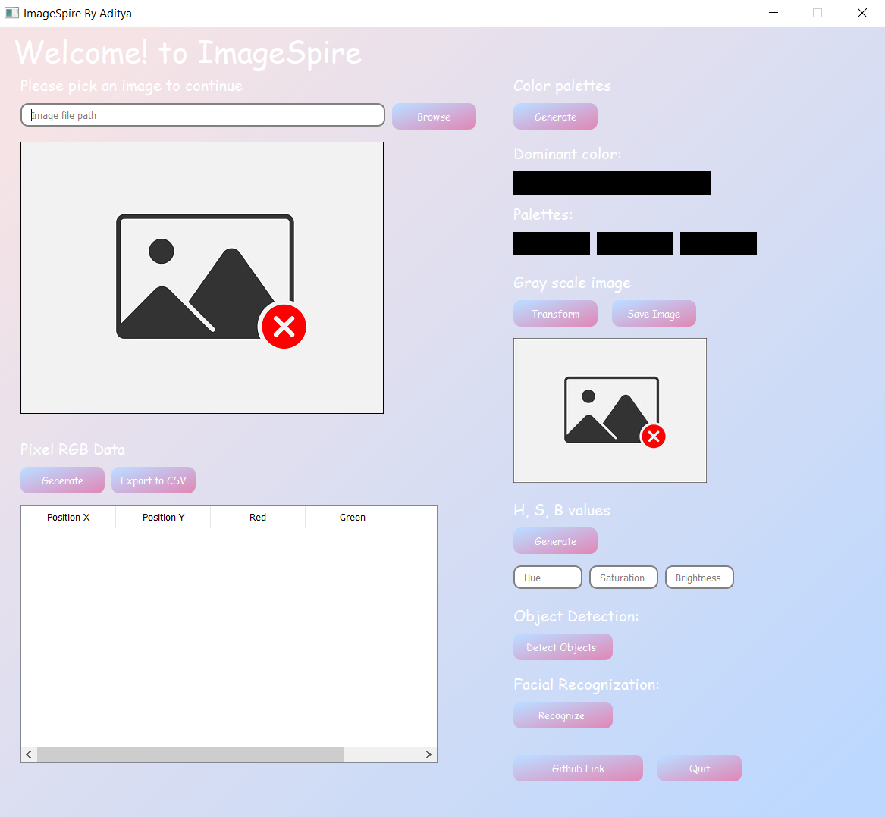

# ImageSpire

ImageSpire is a PyQT5-based program for extracting various data attributes like pixel RGB data, color palette, Hue, Saturation, and Brightness values from an image.
ImageSpire also consists of some basic implementation object detection and facial recognization.

# Screenshots
 
 

